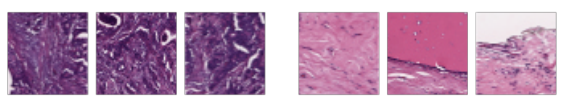
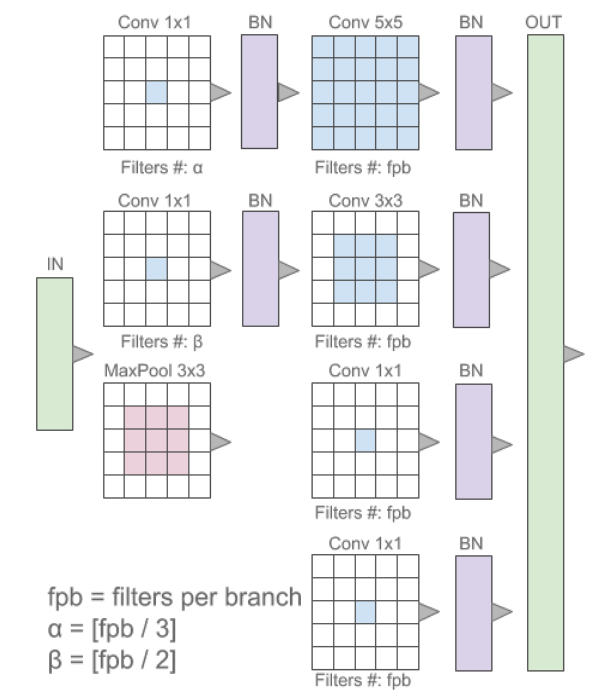
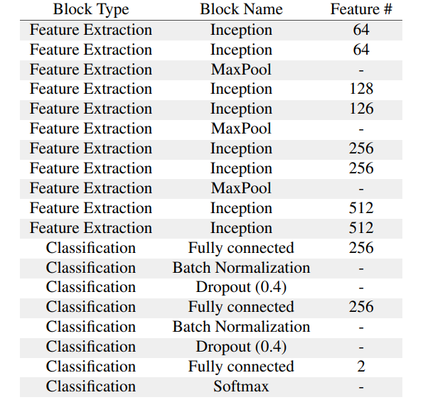
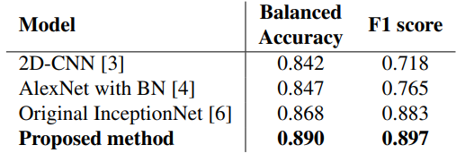

# Deep Histo-Pathology

For a more theoretical information please visit our conference paper at **2019 IEEE 16th International Symposium 
on Biomedical Imaging (ISBI 2019)**
:[https://ieeexplore.ieee.org/abstract/document/8759410](https://ieeexplore.ieee.org/abstract/document/8759410 "paper")  

This repository contains the codes for reproducing the results obtained by out DeepHistoPathology model using an 
Ivasive Ductal Carcinoma open Dataset

The deep learning models were implemented using Keras/Tensorflow framework.
The preprint for this work is availabe at https://arxiv.org/pdf/1901.03684.pdf

- [Introduction](#introduction) 
- [Results](#results)
- [Installation](#installation)
- [References](#references)
- [How to cite DeepFilter](#citing-deepfilter)
- [License](#license)

# Introduction

Breast cancer is the most diagnosed cancer and the most predominant cause of death in women worldwide. 
Imaging techniques such as the breast cancer pathology helps in the diagnosis and monitoring of the disease. 
However identification of malignant cells can be challenging given the high heterogeneity in tissue absorbotion from 
staining agents. In this work, we present a novel approach for Invasive Ductal Carcinoma (IDC) cells discrimination in 
histopathology slides.

We used an open IDC dataset that can be found here:

http://andrewjanowczyk.com/wp-static/IDC_regular_ps50_idx5.zip

https://www.kaggle.com/paultimothymooney/breast-histopathology-images

The following figure shows some samples from the used Open IDC Dataset.  
Left: three IDC cell patches; Right: three normal tissue patches.

We propose a model derived from the Inception architecture, proposing a multi-level batch normalization module between 
each convolutional steps. This module was used as a base block for the feature extraction in a CNN architecture. 
We used the open IDC dataset in which we obtained a balanced accuracy of 0.89 and an F1 score of 0.90, thus surpassing
recent state of the art classification algorithms tested on this public dataset

The following figure shows the used Inception modeules that incorporates Batch normalization. 

The following table shows the overall model architecture.

## Results

The following table present the quantitative results of DeepHP Net compared on the same test set with other SOTA 
methods.

Qualitative results

The figure shows a portion of sele0106 ECG signal.

## Reproducibility
  
### Download this git repository and run local
The firts step is to clone this repository
 
~~~
git clone https://github.com/fperdigon/DeepHistoPathology
~~~

The next step is to create the Conda environment using the provided environment.yml file. For this step you need the 
conda python package manage installed. In case you don't have it installed we recommend installing 
[Miniconda](https://docs.conda.io/projects/conda/en/latest/user-guide/install/) to avoid installing unnecessary Python 
packages. 

To create the conda environment run the following command:
~~~
conda env create -f environment.yaml
~~~

Then activate the Python environment you just created with the following command:

~~~
conda activate DeepHP
~~~

Finally start the training and the experiments by running the command:

~~~
python DeepHP_main.py
~~~

This python script will:
- Download the data to the data folder
- Extract the Data zip in the data folder
- Train the model 
- Calculate performance metrics and display them in the console
- Generate confusion Matrix and ROC curve figures

If you have a Nvidia CUDA capable device for GPU acceleration this code will automatically use it (faster). Otherwise the 
training will be done in CPU (slower).   

## Citing DeepHP

When citing DeepHP please use this BibTeX entry:
   
    @INPROCEEDINGS{8759410,
    author={Romero, Francisco Perdigоn and Tang, An and Kadoury, Samuel},
    booktitle={2019 IEEE 16th International Symposium on Biomedical Imaging (ISBI 2019)}, 
    title={Multi-Level Batch Normalization in Deep Networks for Invasive Ductal Carcinoma Cell Discrimination in Histopathology Images}, 
    year={2019},
    volume={},
    number={},
    pages={1092-1095},
    doi={10.1109/ISBI.2019.8759410}}
    
## License

The MIT License (MIT)

Copyright (c) 2021 Francisco Perdigon Romero

Permission is hereby granted, free of charge, to any person obtaining a copy
of this software and associated documentation files (the "Software"), to deal
in the Software without restriction, including without limitation the rights
to use, copy, modify, merge, publish, distribute, sublicense, and/or sell
copies of the Software, and to permit persons to whom the Software is
furnished to do so, subject to the following conditions:

The above copyright notice and this permission notice shall be included in all
copies or substantial portions of the Software.

THE SOFTWARE IS PROVIDED "AS IS", WITHOUT WARRANTY OF ANY KIND, EXPRESS OR
IMPLIED, INCLUDING BUT NOT LIMITED TO THE WARRANTIES OF MERCHANTABILITY,
FITNESS FOR A PARTICULAR PURPOSE AND NONINFRINGEMENT. IN NO EVENT SHALL THE
AUTHORS OR COPYRIGHT HOLDERS BE LIABLE FOR ANY CLAIM, DAMAGES OR OTHER
LIABILITY, WHETHER IN AN ACTION OF CONTRACT, TORT OR OTHERWISE, ARISING FROM,
OUT OF OR IN CONNECTION WITH THE SOFTWARE OR THE USE OR OTHER DEALINGS IN THE
SOFTWARE.